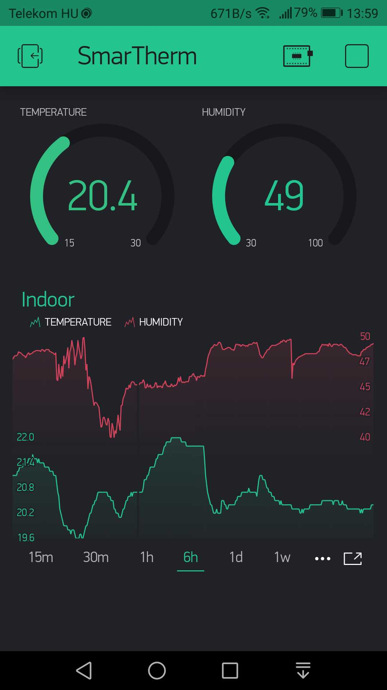

# Solar Wi-Fi Weather Station aka. SolarTherm (IoT device)

A solar powered, network connected thermometer implemented with ESP8266 and BME280.

## Status LED

SmarTherm uses a single common anode (+) RGB LED to visually signal various events and states of the device:

- Blue: The boot sequence is in progress.
- Green: Measurement and updating external services is in progress, or a webrequest is being handled.
- Orange: An over-the-air update is in progress, or the device could not connect to the wireless network and entered access point mode during boot.
- Red: The last over-the-air update has been failed.


## Sending measured data to external services

SmarTherm not only collects data, but forwards them to cloud services.

### Blynk

[Blynk](https://www.blynk.cc/) is a platform with iOS and Androids apps to control and query IoT devices over the Internet. It is a digital dashboard where you can build a graphic interface for your project by simply dragging and dropping widgets.

An example dashboard for Smartherm may look like this:



#### Configuration

To set up Blynk follow these steps:

1. Download the Blynk app from [Apple AppStore](https://itunes.apple.com/us/app/blynk-control-arduino-raspberry/id808760481?ls=1&mt=8) or [Google PlayStore](https://play.google.com/store/apps/details?id=cc.blynk) to your mobile device.
2. Start the mobile app and follow the instructions to create a new project.
3. When you create a new project Blynk sends you an auth token in e-mail. Copy this value from the e-mail and paste it into the `BLYNK_AUTH_TOKEN` parameter in `config.h`.
4. Compile and deploy SmarTherm, and start your device
5. Add widgets to your Blynk dashboard as you wish. SmarTherm will feed the data to the following pins:
- Temperature value is sent to the `V16` virtual pin.
- Humidity value is sent to the `V17` virtual pin.

#### Troubleshooting

In case of any problem connect your device to a serial port monitor and check the logs. For normal operation you should see the following in the log in every measurement cycle:

```
Sending data to Blynk...DONE.
```

##### Invalid auth token

This error is written to the log if the Blynk service rejects your auth token. It can happen if you made a typo, or (and this is interesting) also if you copy-pasted the token from the e-mail. I recommend deleting and manually typing back the first and the last few characters, including the opening and closing quotation marks. (I know it sounds crazy, but worked for me and others also.)


## Event notifications

SmarTherm is capable of sending notifications about the following events:
- An over-the-air update is started.
- An over-the-air update is finished.
- An over-the-air update is failed.
- The device is started.

Events are sent to the free [IFTTT](https://ifttt.com/) Maker service [webhooks](https://ifttt.com/maker_webhooks) in a HTTP POST request. The request has the following parameters:
- The event name is the value set in the `IFTTT_WEBHOOK_EVENT_NAME` variable in `config.h`.
- The API key is the value set in the `IFTTT_WEBHOOK_API_KEY` variable in `config.h`.
- The `value1` parameter contains a title-like short summary of the event (e.g. "Starting").
- The `value2` parameter contains the detailed description of the event.
- The `value3` parameter contains information about the device (name, version, IP and MAC addresses).

### E-mail notifications

IFTTT allows you to forward these events to your e-mail mailbox, to your phone, to trigger an action - almost anything you want, it is totally up to you.

The following configuration shows how to forward the events sent by SmarTherm to your Gmail inbox:

1. On IFTTT [Create a New Applet](https://ifttt.com/create).
2. In the "Choose a service (Step 1 of 6)" step select `Webhooks` as the source ("this").
3. In the "Choose a trigger (Step 2 of 6)" step select `Receive a web request`.
4. In the "Complete trigger fields (Step 2 of 6)" step enter the event name you specified in `IFTTT_WEBHOOK_EVENT_NAME` value in `config.h`, for example `SmarTherm`, and click the "Create Trigger" button.
5. In the "Choose action service (Step 3 of 6)" step select `Gmail` as the target ("that").
6. In the "Choose action (Step 4 of 6)" step select `Send an email`.
7. In the "Complete action fields (Step 5 of 6)" set the fields as the following:
  - Set "To address" to the destination e-mail address.
  - Set "Subject" to `[SmarTherm] {{Value1}}`
  - Set the "Body (optional)" to this value:
  ```
{{Value2}}<br>
<br>
Device: {{Value3}}<br>
<br>
When: {{OccurredAt}}
  ```
  - Click the "Create action" button.
8. In the "Review and finish (Step 6 of 6)" step click the "Finish" button.

To get your API key, navigate to the https://ifttt.com/maker_webhooks page and click the "Documentation" link on the top. Copy the API key from that page and paste it into the `IFTTT_WEBHOOK_API_KEY` variable in `config.h`.


## Over-the-air updates (OTA)

ESP8266 [supports](https://arduino-esp8266.readthedocs.io/en/latest/ota_updates/readme.html) over the air updates out of the box, so you can load the firmware to the ESP using Wi-Fi connection rather than a serial port.

### Security disclaimer

Make sure you read the [Security disclaimer](https://arduino-esp8266.readthedocs.io/en/latest/ota_updates/readme.html#security-disclaimer) and other security related sections in the official documentation to understand the risks!


### Prerequisites
- [Python 2.7](https://www.python.org/) (v3 is not supported yet). Make sure you check the _Add python.exe to Path_ option during installation on Windows.
- [Arduino IDE](https://www.arduino.cc/en/Main/Software) 1.6.7+

### Steps

1. Customize the parameters in `config.h`:
  - The `OTA_UPDATE_HOSTNAME` parameter defines the name for your device as it should appear during the update, for example in the Arduino IDE.
  - The `OTA_UPDATE_PASSWORD` parameter defines a secret that is requested by the device to allow loading a new firmware. Make sure you set a strong password! If it is set to `NULL`, then anyone can modify the code on your device who has access to your wireless network. Note: Visual Studio Code does not support OTA with password yet.
2. Load the initial version of the code to the ESP through USB.
3. **Important:** Reset the device!
4. Figure out the IP address of your device.
5. Start or restart Arduino IDE, and load the new version of your code.
6. In the **Tools** menu change **Port** to **SmarTherm at 192.168.0.111** (it will vary based on the name you set in `config.h` and the IP address of your device).
7. Click **Upload**. Arduino IDE will ask for the password you set in `config.h`, because you did set one, right?

### Over-the-air updates from Visual Studio Code

Visual Studio Code has [limited support](https://github.com/Microsoft/vscode-arduino/issues/359) for OTA updates:

- It does not support passwords for OTA, so you have two options:
  - Be really secure, set a password, and use the Arduino IDE for OTA updates.
  - Set the password to `NULL` in `config.h`, and use VS Code for your pleasure. Make sure that in this way you add just another insecure IoT device into the existing world of insecure IoT devices.

- VS Code is not able to discover devices on your network, so you can't conveniently select the IP address in the Port menu. To resolve this, you have to manually replace the serial port with the IP address of your device in `arduino.json`. For example:

```
{
    ...
    "port": "192.168.0.107",
    ...
}
```

### Troubleshooting

#### Connection failure

You may receive the following error after starting an OTA update:

```
Start updating sketch
Connect Failed
Error[2]: Connect Failed
Error[4]: End Failed
ERROR[0]: No Error
```

Or the following error:

```
Uploading...
[ERROR]: No response from device
An error occurred while uploading the sketch
```

During OTA update your ESP device tries to connect to your computer to download the new code. To enable this make sure that you have a hole in your firewall, and your antivirus software (e.g. ESET) does not block this kind of requests.

#### Python.exe is not found

You may receive the following error after starting as OTA update, even if you have selected to add python.exe to the Path during installation on Windows:

```
Cannot run program "python.exe": CreateProcess error=2, The system cannot find the file specified
```

This error may come in VS Code even if OTA upload works successfully in Arduino IDE.

The solution is to edit `platform.txt` in the `C:\Users\<YOURNAME>\AppData\Local\Arduino15\packages\esp8266\hardware\esp8266\2.4.2` folder, and set the full path to `python.exe`:

```
tools.esptool.network_cmd.windows=C:/Python27/python.exe
```

#### Monitoring the upload

During upload your ESP device will send debug log messages through the serial port. So if OTA does not work, connect your device to your computer, start a serial monitoring tool (e.g. [Termite](https://www.compuphase.com/software_termite.htm)), and start the OTA update through the wireless network.

You can customize the messages in the `ota-updater.cpp` file.

## About the author

This project is maintained by [György Balássy](https://linkedin.com/in/balassy).