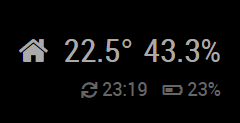

# Solar Wi-Fi Weather Station aka. SolarTherm (IoT device)

A solar powered, network connected thermometer implemented with ESP8266, BME280 and Visual Studio Code.

## Features

SolarTherm is:
- a **wireless** IoT device,
- that is powered by battery which is charged by **solar energy**,
- and connects to your **WiFi** network.

SolarTherm can:
- periodically measure **temperature and humidity**,
- forward the measured data to **[Blynk](https://www.blynk.cc/)**, **[ThingSpeak](https://thingspeak.com)** and **[MagicMirror](https://github.com/MichMich/MagicMirror)**,
- signal its status with an **RGB LED**,
- send status notifications through **[IFTTT](https://ifttt.com/)** (e.g. to e-mail),
- save battery power by going to **deep sleep** between measurement cycles,
- render a **configuration webpage** to set your WiFi credentials,
- automatically update itself.

## On this page

- [Features](#features)
- [Getting started](#getting-started)
  - [Hardware](#hardware)
  - [Software](#software)
  - [Configuration](#configuration)
- [Status LED](#status-led)
- [Sending measured data to external services](#sending-measured-data-to-external-services)
  - [Blynk](#blynk)
    - [Configuration](#configuration-1)
    - [Troubleshooting](#troubleshooting)
  - [Thingspeak](#thingspeak)
    - [Configuration](#configuration-2)
  - [MagicMirror](#magicmirror)
    - [Configuration](#configuration-3)
    - [Limitation](#limitation)
- [Event notifications](#event-notifications)
  - [E-mail notifications](#e-mail-notifications)
- [Over-the-air updates (OTA) (Work In Progress)](#over-the-air-updates-ota-work-in-progress)
  - [Security disclaimer](#security-disclaimer)
  - [Prerequisites](#prerequisites)
  - [Steps](#steps)
  - [Over-the-air updates from Visual Studio Code](#over-the-air-updates-from-visual-studio-code)
  - [Troubleshooting](#troubleshooting-1)
    - [Connection failure](#connection-failure)
    - [Python.exe is not found](#pythonexe-is-not-found)
    - [Monitoring the upload](#monitoring-the-upload)
- [Acknowledgements](#acknowledgements)
- [About the author](#about-the-author)

(This Table of Contents was generated with [nGitHubTOC](https://imthenachoman.github.io/nGitHubTOC/), but [sompylasar's solution](https://github.com/isaacs/github/issues/215#issuecomment-456598835) is also very usable.)

## Getting started

### Hardware

Build the hardware recommended by Open Green Energy in his [Solar Powered WiFi Weather Station v2.0](https://www.instructables.com/id/Solar-Powered-WiFi-Weather-Station-V20/) project.

Optional:
Build the Status LED Shield detailed in the [Status LED](#status-led) section of this guide.

### Software

This project was built and tested with [Visual Studio Code](https://code.visualstudio.com/), but you can also use the [Arduino IDE](https://www.arduino.cc/en/Main/Software) to compile and upload it to your board.

You have to install the following libraries this project depends on to your development environment:
- [Blynk](https://github.com/blynkkk/blynk-library.git) by Volodymyr Shymanskyy (tested with version 1.0.1).
- [WiFiManager](https://github.com/tzapu/WiFiManager.git) by tzapu (tested with version 0.16.0).
- [Adafruit Unified Sensor](https://github.com/adafruit/Adafruit_Sensor) by Adafruit (tested with version 1.1.4).
- [Adafruit BusIO](https://github.com/adafruit/Adafruit_BusIO) by Adafruit (tested with version 1.9.1).
- [Adafruit BME280 Library](https://github.com/adafruit/Adafruit_BME280_Library) by Adafruit (tested with version 2.2.1).

### Configuration

Rename the `config.sample.h` file to `config.h`, and modify the values accordingly.

See the sections below for more information about the particular features that can be configured in this file.

After turning on the device the first time it will enter into configuration mode which is indicated by the orange LED, if you added the Status LED Shield (see below). In configuration mode SolarTherm acts as a WiFi access point. The SSID name and the password to connect to this access point can be specified in the `WIFI_AP_SSID` and `WIFI_AP_PASSWORD` parameters in `config.h`. Use your computer to connect to this network, then navigate to `http://192.168.4.1` in your web browser to open the configuration portal where you can select the preferred wireless network and set the WiFi password for SolarTherm.

Important: SolarTherm will wait for user interaction only for 60 minutes on the configuration portal, then restarts automatically. This timeout can be configured in the `WIFI_CONFIG_PORTAL_TIMEOUT_SECONDS` parameter in `config.h`.

## Status LED

SolarTherm uses a single common anode (+) RGB LED to visually signal various events and states of the device:

- Blue: The boot sequence is in progress.
- Green: Measurement and updating external services is in progress.
- Orange: An over-the-air update is in progress, or the device could not connect to the wireless network and entered access point mode during boot.
- Red: The last over-the-air update has been failed.

To save GPIO pins the default configuration uses on-board Blue LED, so only red and green pins of the RGB LED should be connected to the P3 connector of the board:


The code works perfectly without this status LED shield without any modification, so if you want to save battery power you can skip adding this module.

## Sending measured data to external services

SolarTherm not only collects data, but forwards them to cloud services.

### Blynk

[Blynk](https://www.blynk.cc/) is a platform with iOS and Androids apps to control and query IoT devices over the Internet. It is a digital dashboard where you can build a graphic interface for your project by simply dragging and dropping widgets.

An example dashboard for SolarTherm may look like this:


#### Configuration

To set up Blynk follow these steps:

1. Download the Blynk app from [Apple AppStore](https://itunes.apple.com/us/app/blynk-control-arduino-raspberry/id808760481?ls=1&mt=8) or [Google PlayStore](https://play.google.com/store/apps/details?id=cc.blynk) to your mobile device.
2. Start the mobile app and follow the instructions to create a new project.
3. When you create a new project Blynk sends you an auth token in e-mail. Copy this value from the e-mail and paste it into the `BLYNK_AUTH_TOKEN` parameter in `config.h`.
4. Compile and deploy SolarTherm, and start your device
5. Add widgets to your Blynk dashboard as you wish. SolarTherm will feed the data to the following pins:
- Temperature value (°C) is sent to the `V16` virtual pin.
- Humidity value (%) is sent to the `V17` virtual pin.
- Battery level value (Volt) is sent to the `V18` virtual pin.

#### Troubleshooting

In case of any problem connect your device to a serial port monitor and check the logs. For normal operation you should see the following in the log in every measurement cycle:

```
Sending data to Blynk...DONE.
```

##### Invalid auth token

This error is written to the log if the Blynk service rejects your auth token. It can happen if you made a typo, or (and this is interesting) also if you copy-pasted the token from the e-mail. I recommend deleting and manually typing back the first and the last few characters, including the opening and closing quotation marks. (I know it sounds crazy, but worked for me and others also.)


### Thingspeak

[ThingSpeak](https://thingspeak.com) is an open-source Internet of Things (IoT) application and API to store and retrieve data from things using the HTTP protocol over the Internet or via a Local Area Network.

An example dashboard for SolarTherm may look like this:


#### Configuration

To display SolarTherm data on ThingSpeak you have to [create a new channel](https://thingspeak.com/channels/new). Most of the fields are self-explanatory on this form, however you have to be careful to set these fields accordingly:
- Field 1: Temperature
- Field 2: Humudity
- Field 3: Battery level

After creating the channel navigate to the **API Keys** tab and copy-paste the **Write API Key** into the `THINGSPEAK_API_KEY` parameter in `config.h`.

Add widgets and visualizations to your channel as you wish and enjoy! 

### MagicMirror

[Magic Mirror](https://magicmirror.builders/) (known as MagicMirror²) is an open source, modular smart mirror platform, and SolarTherm is able to push measured temperature, humidity and battery level data to MagicMirror to display them immediately.

An example display of the measured data on MagicMirror may look like this:



#### Configuration

To set up the SolarTherm-MagicMirror connection follow these steps:

1. Install the [MMM-RemoteTemperature](https://github.com/balassy/MMM-RemoteTemperature) module on your MagicMirror.
2. Configure the module as you prefer.
3. In SolarTherm's `config.h` specify the protocol, address and host in the `MAGIC_MIRROR_HOST` parameter.

That's it! In every measurement cycle SolarTherm will push the data to your MagicMirror.

#### Limitation

At the moment SolarTherm does not support the `sensorId` parameter of the MMM-RemoteTemperature module.


## Event notifications

SolarTherm is capable of sending notifications about the following events:
- An over-the-air update is started.
- An over-the-air update is finished.
- An over-the-air update is failed.
- The device is started or an unexpected reset happened.

Events are sent to the free [IFTTT](https://ifttt.com/) Maker service [webhooks](https://ifttt.com/maker_webhooks) in a HTTP POST request. The request has the following parameters:
- The event name is the value set in the `IFTTT_WEBHOOK_EVENT_NAME` variable in `config.h`.
- The API key is the value set in the `IFTTT_WEBHOOK_API_KEY` variable in `config.h`.
- The `value1` parameter contains a title-like short summary of the event (e.g. "Starting").
- The `value2` parameter contains the detailed description of the event.
- The `value3` parameter contains information about the device (name, version, IP and MAC addresses).

### E-mail notifications

IFTTT allows you to forward these events to your e-mail mailbox, to your phone, to trigger an action - almost anything you want, it is totally up to you.

The following configuration shows how to forward the events sent by SolarTherm to your Gmail inbox:

1. On IFTTT [Create a New Applet](https://ifttt.com/create).
2. In the "Choose a service (Step 1 of 6)" step select `Webhooks` as the source ("this").
3. In the "Choose a trigger (Step 2 of 6)" step select `Receive a web request`.
4. In the "Complete trigger fields (Step 2 of 6)" step enter the event name you specified in `IFTTT_WEBHOOK_EVENT_NAME` value in `config.h`, for example `SolarTherm`, and click the "Create Trigger" button.
5. In the "Choose action service (Step 3 of 6)" step select `Gmail` as the target ("that").
6. In the "Choose action (Step 4 of 6)" step select `Send an email`.
7. In the "Complete action fields (Step 5 of 6)" set the fields as the following:
  - Set "To address" to the destination e-mail address.
  - Set "Subject" to `[SolarTherm] {{Value1}}`
  - Set the "Body (optional)" to this value:
  ```
{{Value2}}<br>
<br>
Device: {{Value3}}<br>
<br>
When: {{OccurredAt}}
  ```
  - Click the "Create action" button.
8. In the "Review and finish (Step 6 of 6)" step click the "Finish" button.

To get your API key, navigate to the https://ifttt.com/maker_webhooks page and click the "Documentation" link on the top. Copy the API key from that page and paste it into the `IFTTT_WEBHOOK_API_KEY` variable in `config.h`.


## Over-the-air updates (OTA) (Work In Progress)

**IMPORTANT: The OTA update functionality is being rewritten due to its conflict with the deep sleep battery saver functionality of the module. The sections below are outdated.**

ESP8266 [supports](https://arduino-esp8266.readthedocs.io/en/latest/ota_updates/readme.html) over the air updates out of the box, so you can load the firmware to the ESP using Wi-Fi connection rather than a serial port.

### Security disclaimer

Make sure you read the [Security disclaimer](https://arduino-esp8266.readthedocs.io/en/latest/ota_updates/readme.html#security-disclaimer) and other security related sections in the official documentation to understand the risks!


### Prerequisites
- [Python 2.7](https://www.python.org/) (v3 is not supported yet). Make sure you check the _Add python.exe to Path_ option during installation on Windows.
- [Arduino IDE](https://www.arduino.cc/en/Main/Software) 1.6.7+

### Steps

1. Customize the parameters in `config.h`:
  - The `OTA_UPDATE_HOSTNAME` parameter defines the name for your device as it should appear during the update, for example in the Arduino IDE.
  - The `OTA_UPDATE_PASSWORD` parameter defines a secret that is requested by the device to allow loading a new firmware. Make sure you set a strong password! If it is set to `NULL`, then anyone can modify the code on your device who has access to your wireless network. Note: Visual Studio Code does not support OTA with password yet.
2. Load the initial version of the code to the ESP through USB.
3. **Important:** Reset the device!
4. Figure out the IP address of your device.
5. Start or restart Arduino IDE, and load the new version of your code.
6. In the **Tools** menu change **Port** to **SolarTherm at 192.168.0.111** (it will vary based on the name you set in `config.h` and the IP address of your device).
7. Click **Upload**. Arduino IDE will ask for the password you set in `config.h`, because you did set one, right?

### Over-the-air updates from Visual Studio Code

Visual Studio Code has [limited support](https://github.com/Microsoft/vscode-arduino/issues/359) for OTA updates:

- It does not support passwords for OTA, so you have two options:
  - Be really secure, set a password, and use the Arduino IDE for OTA updates.
  - Set the password to `NULL` in `config.h`, and use VS Code for your pleasure. Make sure that in this way you add just another insecure IoT device into the existing world of insecure IoT devices.

- VS Code is not able to discover devices on your network, so you can't conveniently select the IP address in the Port menu. To resolve this, you have to manually replace the serial port with the IP address of your device in `arduino.json`. For example:

```
{
    ...
    "port": "192.168.0.107",
    ...
}
```

### Troubleshooting

#### Connection failure

You may receive the following error after starting an OTA update:

```
Start updating sketch
Connect Failed
Error[2]: Connect Failed
Error[4]: End Failed
ERROR[0]: No Error
```

Or the following error:

```
Uploading...
[ERROR]: No response from device
An error occurred while uploading the sketch
```

During OTA update your ESP device tries to connect to your computer to download the new code. To enable this make sure that you have a hole in your firewall, and your antivirus software (e.g. ESET) does not block this kind of requests.

#### Python.exe is not found

You may receive the following error after starting as OTA update, even if you have selected to add python.exe to the Path during installation on Windows:

```
Cannot run program "python.exe": CreateProcess error=2, The system cannot find the file specified
```

This error may come in VS Code even if OTA upload works successfully in Arduino IDE.

The solution is to edit `platform.txt` in the `C:\Users\<YOURNAME>\AppData\Local\Arduino15\packages\esp8266\hardware\esp8266\2.4.2` folder, and set the full path to `python.exe`:

```
tools.esptool.network_cmd.windows=C:/Python27/python.exe
```

#### Monitoring the upload

During upload your ESP device will send debug log messages through the serial port. So if OTA does not work, connect your device to your computer, start a serial monitoring tool (e.g. [Termite](https://www.compuphase.com/software_termite.htm)), and start the OTA update through the wireless network.

You can customize the messages in the `ota-updater.cpp` file.


## Acknowledgements

Thanks to Open Green Energy for sharing his [Solar Powered WiFi Weather Station v2.0](https://www.instructables.com/id/Solar-Powered-WiFi-Weather-Station-V20/) project.


## About the author

This project is maintained by [György Balássy](https://linkedin.com/in/balassy).